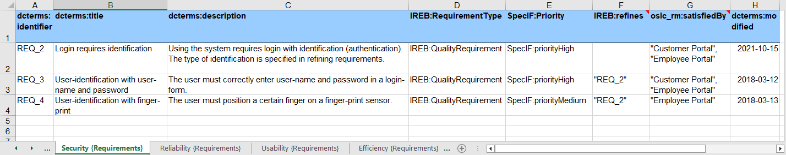
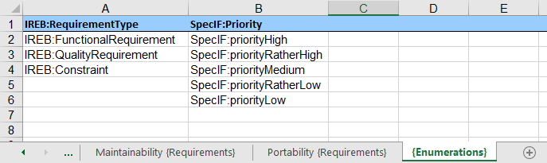

# Introduction to Sheet → ReqIF

## Purpose

Transform a workbook with one or more spreadsheets (Excel® *.xlsx, LibreOffice *.ods as well as *.csv) to the Requirements Interchange Format (ReqIF).

The app can be used with a web browser. It uses code modules and the ontology developed by the [SpecIF](https://specif.de) initiative.
The browser scripts are fetched from the web-server, while all user data is processed only in the browser: 
There is no 'backend' and no transfer of user data over the internet: Input files are fetched from devices controlled by the local machine
and output files are equally stored on such a device. 


## Setup

### Install the App on a Web-Server

Download the last released program version “tools.vX.Y.zip” from 
<a href="https://github.com/enso-managers/SpecIF-Tools/releases" target="_blank">https://github.com/enso-managers/SpecIF-Tools/releases</a>, 
to be found in the collapsible “assets” section, and unzip the file in the file system of the web server of your choice. 
Enter "http://domain.tld/path/sheet2reqif.html" in the address line of your web browser to start the app. 
Of course, "domain.tld/path/" has to be replaced according to your installation.

Many environments such as MS Teams® inhibit the execution of scripts and are thus not suited for installation of the app.

### Use the Installed App

If the guidelines of your network permit, you can use the <a href="https://tools.enso-managers.de/sheet2reqif.html" target="_blank">Sheet → ReqIF</a> 
provided for demonstration purposes. 
You always benefit from the latest release.

## Operation

### Sheets Become Folders

When importing a workbook with one or more spreadsheets (Excel® *.xlsx, LibreOffice *.ods as well as *.csv), 
a folder with the file name as title is created in the hierarchy of the ReqIF data-set. 
For each spreadsheet a subfolder is created with its name as title. 

### Resources and Resource Classes

If there is a term in curly brackets at the end of a worksheet name, a SpecIF resourceClass associated to that title 
as defined by the ontology is selected as type of all resources/objects found on this worksheet. 
Otherwise, a term in curly brackets in the file name is used as a substitute. 
In both cases a specific meaning is attributed to the resources/objects. 

If no type designation is found at all, a new resourceClass is defined with a generic title without a particular meaning.

Unfortunately, no ontology term ready for interpretation by the system can be used in the filename, 
as certain characters (e.g. the colon) are not allowed in filenames. 
However, some terms including “requirement”, “feature”, “annotation”, “user-story” and “pain-point“ 
(as well as any other local term as defined by the ontology) are interpreted correctly 
by the tool and replaced by an ontology term.

For example, if a  file has the file name "Project-name {Requirement}.xslx" and it contains two worksheets 
named "Functions {User Story}" resp. "Constraints", 
a resourceClass with the title "User-Story" normalized by 
<a href="https://specif.de/apps/edit.html#import=https://specif.de/v1.1/Ontology.specif;view=doc;node=N-QacIoFiQ3a268UVZO9mHsqqrwdo" target="_blank">SpecIF:UserStory</a> 
is assumed for the first worksheet and 
a resourceClass with the title "Requirement" normalized by 
<a href="https://specif.de/apps/edit.html#import=https://specif.de/v1.1/Ontology.specif;view=doc;node=N-JissrCtZ51CD04LeneSqolLFJpA" target="_blank">IREB:Requirement</a> 
for the second worksheet.

### Properties

Now for the contents of each worksheet. The property names (SpecIF property titles) are expected in 
the first line of each worksheet and the resources ("instances") follow from the second line. 
Defined ontology terms are best used as property names, e.g. dcterms:title and dcterms:description from 
the <a href="https://www.dublincore.org/" target="_blank">Dublin Core Metadata Initiative</a>. 
The use of agreed terms conveys the meaning of the respective properties so that, just one of the potential benefits, 
the normalized term can be further translated to the respective name for use with ReqIF.
For example, the title (denoted by _dcterms:title_) will be translated to _ReqIF.Name_.

In fact, a double translation is made using the ontology: A local term such as _Beschreibung_ (in German) is
first normalized to _dcterms:description_ and then to _ReqIF.Text_.

Suitable property class terms are defined in the 
&#x2197;&#xA0;<a href="https://specif.de/apps/edit.html#import=https://specif.de/v1.1/Ontology.specif;view=doc;node=N-33z8X0jqbMdrd8PJDKyt2ke4yAB" target="_blank">SpecIF Ontology</a>.

Finally, formatting in worksheet cells using <a href="https://www.markdownguide.org/cheat-sheet/" target="_blank">markdown</a> 
is transformed to XHTML in the respective ReqIF attribute value fields.

### Enumerated Values

To define a property with enumerated values, a worksheet with name _{Enumerations}_ including the curly brackets is created. 
Here all eligible values of a certain property are specified column by column. 
Again, the first line specifies the property name and the values below up to the next blank field define the enumerated values. 
In worksheets with user data, these values are provided for properties with the same name; 
in the example given shown by screenshot, these are the properties named _IREB:RequirementType_ and _SpecIF:Priority_. 
While Excel® also allows the specification of deviating values, this is not possible in case of SpecIF, therefore all values 
that are not listed in the worksheet _{Enumerations}_ are ignored during import.

_Note: Excel® assists the user in entering values through a selection box when the values listed in the "{Enumerations}" 
spreadsheet are selected for the respective column using the menu Data > Data Tools > Data Validation._

Suitable property value terms are defined in the 
&#x2197;&#xA0;<a href="https://specif.de/apps/edit.html#import=https://specif.de/v1.1/Ontology.specif;view=doc;node=N-GXf6xVO7XO5ciMypRwD5WDR6DHR" target="_blank">SpecIF Ontology</a>.

### Relations

The same goes for the names of relationships (SpecIF statements); for example _oslc_rm:refinedBy_ between two requirements 
or _oslc_rm:satisfies_ between a system component and a requirement. In order to successfully create relationships, 
the user-defined IDs (_dcterms:identifier_) or titles (_dcterms:title_) of the respective elements must be given 
between double or single quotation marks. Multiple resources can be specified separated by commas. 
See columns _IREB:refines_ and _oslc_rm:satisfiedBy_ in the following figure.

By the way, the target of a relation like "Customer Portal" in the screenshot does not have to be found in the same file. 
The relation is also established to a resource that originates from a different source, as long as the title resp. ID match.

Suitable statement class terms are defined in the 
&#x2197;&#xA0;<a href="https://specif.de/apps/edit.html#import=https://specif.de/v1.1/Ontology.specif;view=doc;node=N-blM4lfyHM55YlbfBZ3NWj4SYwa3" target="_blank">SpecIF Ontology</a>.

### Example

This &#x2913;&#xA0;<a href="./examples/Example%20Telephone-Connection-Request%20{Requirements}.xlsx" target="_blank">example</a> 
shows the described conventions. Here, ontology terms have also been chosen for the enumerated property values, thus conveying a specific meaning.
Of course, any terms can be used in the spreadsheet, which will then be passed unchanged to the ReqIF attribute value, however without a defined meaning.

## Terms of Use

### License

Both SpecIF as a format with schema and consistency checker as well as the SpecIF tools are open source and are subject to 
the <a href="https://github.com/GfSE/SpecIF/blob/master/LICENSE" target="_blank">Apache 2.0 license</a>, 
which also allows free use for commercial applications. If used in your own product, the origin must be referenced.

### Support

In case you discover a conceptual inconsistency, a software bug, a flaw in documentation or wish to request a feature,
please open an <a href="https://github.com/enso-managers/SpecIF-Tools/issues" target="_blank">issue</a>
with a concise description and ideally test-data.
We are highly interested to supply high-quality concepts and useful software.

### No Guarantee and No Liability

SpecIF and the app are provided "as-is" and without guaranteed characteristics. 
Use is always at your own risk. Any liability and guarantee are excluded. 
The installation at <a href="https://tools.enso-managers.de" target="_blank">https://tools.enso-managers.de</a> and the code maintained 
at <a href="https://github.com/enso-managers" target="_blank">https://github.com/enso-managers</a> is a reference implementation 
and not designed for high loads and high availability.

<!-- link template  -->
