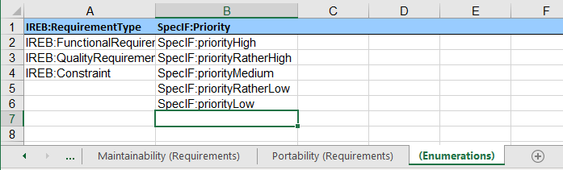
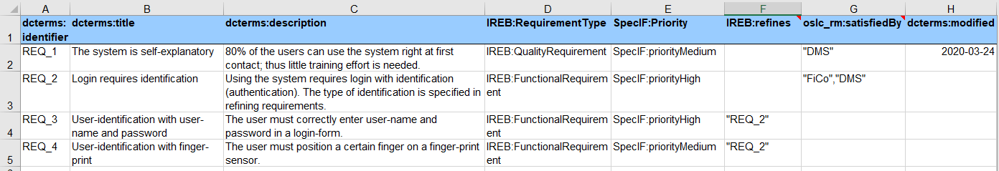

# Manual Sheet → ReqIF

## Setup

The app can be used with a web browser. It uses code modules and the ontology developed by the [SpecIF](https://specif.de) initiative. 

### Install the App on a Web-Server

Download the last released program version “tools.vX.Y.zip” from 
<a href="https://github.com/enso-managers/SpecIF-Tools/releases" target="_blank">https://github.com/enso-managers/SpecIF-Tools/releases</a>, 
to be found in the collapsible “assets” section, and unzip the file in the file system of the web server of your choice. 
Enter "http://domain.tld/path/sheet2reqif.html" in the address line of your web browser to start the app. 
Of course, "domain.tld/path/" has to be replaced according to your installation.

### Use the Installed App

If the guidelines of your network permit, you can use the <a href="https://tools.enso-managers.de/sheet2reqif.html" target="_blank">Sheet → ReqIF</a> 
provided for demonstration purposes. 
You always benefit from the latest release.

## Operation

### Folder

When importing Excel® files, a folder with the file name as title is created in the hierarchy of the SpecIF data-set. 
For each worksheet a subfolder is created with its name as a title. 

### Resources and Resource Classes

If there is a term in curly brackets at the end of a worksheet name, it is used as the title of the resource class 
(SpecIF resourceClass, type of all resources/objects found on this worksheet). 
Otherwise, a term in curly brackets in the file name is used as a substitute. 
If no type designation is found at all, a generic title without a particular meaning is used for the resource class of the worksheet.

Unfortunately, no ontology term ready for interpretation by the system can be used in the filename, 
as certain characters (e.g. the colon) are not allowed in filenames. 
However, some terms including “requirement”, “feature”, “annotation”, “user-story” and “pain-point“ are interpreted correctly 
by the tool and replaced by an ontology term.

For example, if an Excel file has the file name "Project-name {Requirement}.xslx" and it contains two worksheets 
named "Functions {User Story}" resp. "Constraints", 
a resource-class with the title "User-Story" replaced by "SpecIF:UserStory" is assumed for the first worksheet and 
a resource-class with the title "Requirement" replaced by "IREB:Requirement" 
for the second worksheet.

### Properties

Now for the contents of each worksheet. The property names (SpecIF property titles) are expected in 
the first table line of each worksheet and the resources ("instances") follow from the second line. 
Defined ontology terms are best used as attribute names, e.g. dcterms:title and dcterms:description from 
the <a href="https://www.dublincore.org/" target="_blank">Dublin Core Metadata Initiative</a>. 
The use of agreed terms conveys the meaning of the respective attributes so that, just one of the potential benefits, 
the normalized term can be further translated to the respective name for use with ReqIF.
For example, the title (denoted by dcterms:title) will be translated to ReqIF.Name.

In fact, a double translation is made, if the ontology supports it. A local term such as _Beschreibung_ (in German) is
first normalized to _dcterms:description_ and then to _ReqIF.Text_.

Finally, formatting in text fields using <a href="https://www.markdownguide.org/cheat-sheet/" target="_blank">markdown</a> 
is transformed to XHTML in the respective ReqIF attribute value fields.

### Enumerated Values

To define an attribute with enumerated values, a worksheet with name _{Enumerations}_ including the curly brackets is created. 
Here all eligible values of a certain attribute are specified column by column. 
Again, the first line specifies the attribute name and the values below up to the next blank field define the enumerated values. 
In worksheets with user data, these values are provided for attributes with the same name; 
in the example given to the left, these are the attributes named _IREB:RequirementType_ and _SpecIF:Priority_. 
While Excel® also allows the specification of deviating values, this is not possible in case of SpecIF, therefore all values 
that are not listed in the worksheet _{Enumerations}_ are ignored during import.

_Note: Excel® assists the user in entering values through a selection box when the values listed in the "{Enumerations}" 
worksheet are selected for the respective column using the menu Data > Data Tools > Data Validation._

This <a href="./examples/Example%20Telephone-Connection-Request%20{Requirements}.xlsx" target="_blank">example</a> 
shows the described conventions. Here vocabulary terms have also been chosen for the enumerated attribute values. 
These are replaced in SpecIF Editor/Viewer by terms of the active national language, 
for example _SpecIF:priorityHigh_ is displayed as _hoch_ if German is selected in the browser. 
Of course, any terms can be used in the Excel worksheet, which will then be passed unchanged to 
the ReqIF attribute value, however without a defined meaning.

### Relations

The same goes for the names of relationships (SpecIF statements); for example _oslc_rm:refinedBy_ between two requirements 
or _oslc_rm:satisfies_ between a system component and a requirement. In order to successfully create relationships, 
the user-defined IDs (_dcterms:identifier_) or titles (_dcterms:title_) of the respective elements must be given 
between double or single quotation marks. Multiple resources can be specified separated by commas. 
See columns _IREB: refines_ and _oslc_rm:satisfiedBy_ in the following figure.

By the way, the target of a relation like "DMS" in the figure does not have to be found in the same file. 
The relation is also established to a resource that originates from a different source, as long as the title resp. ID are identical.

Suitable terms are defined in the 
<a href="https://specif.de/apps/view.html#import=https://specif.de/v1.1/Ontology.specif" target="_blank">SpecIF Ontology</a>.

## Terms of Use

### License

Both SpecIF as a format with schema and consistency checker as well as the SpecIF viewer/editor are open source and are subject to 
the <a href="https://github.com/GfSE/SpecIF/blob/master/LICENSE" target="_blank">Apache 2.0 license</a>, 
which also allows free use for commercial applications. If used in your own product, the origin must be referenced.

### Support

In case you discover a conceptual inconsistency, a software bug, a flaw in documentation or wish to request a feature,
please open an <a href="https://github.com/GfSE/SpecIF-Viewer/issues" target="_blank">issue</a>
with a concise description and ideally test-data.
We are highly interested to supply high-quality concepts and useful software.

### No Guarantee and No Liability

SpecIF and the app are provided "as-is" and without guaranteed characteristics. 
Use is always at your own risk. Any liability and guarantee are excluded. 
The installation at <a href="http://specif.de/apps/" target="_blank">http://specif.de/apps/</a> and the code maintained 
at <a href="https://github.com/GfSE" target="_blank">https://github.com/GfSE</a> is a reference implementation and not designed for high loads and high availability.

<!-- link template  -->
